<p align="center">
  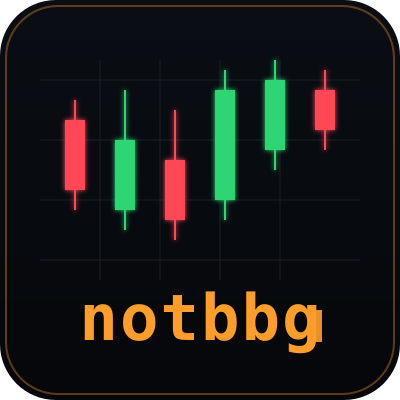
</p>

<h1 align="center">notbbg</h1>

<p align="center">
  <a href="#"></a>
  <a href="#"></a>
  <a href="#"></a>
  <a href="#"></a>
  <a href="#"></a>
  <a href="LICENSE"></a>
</p>

<p align="center">
  <sub>* Windows builds, but is not fully tested yet.</sub>
</p>

<p align="center">
  <b>Self-hosted market data terminal for casual traders.</b><br>
  Bloomberg-style TUI, cross-platform desktop GUI, and a read-only phone companion — fed by a single Go server that streams from 17+ sources and backs up to your home machine over post-quantum TLS.
</p>

<p align="center">
  Built for people who want pro-grade market tooling without the monthly terminal fee: runs on a laptop, pairs with a phone, persists everything to a Hive-partitioned datalake.
</p>

---

> **v0.2.0** — actively developed. Phone app is experimental. See [SPEC.md](SPEC.md) for the roadmap.

> ⚠️ **Interim update — 2026-04-29.** `main` is ahead of the last
> publicly-pushed commit by several in-flight tracks (adapter
> wiring for Sibelius/Ravel/tsbase-files, HTTP `GetDataRange`
> streaming, TUI progressive history, phone TRADES ANR fix +
> modal picker, Uniswap verification, OHLC pipeline cleanup,
> formulettes plugin REPL). These haven't gone through full
> manual end-to-end testing across all three GUIs yet. If you
> need a build that "just runs", check out the last published
> push at commit [`289139c`](../../commit/289139c) (or
> `git checkout 289139c`) — that's the last manually-verified
> release point. See [STATUS.md](STATUS.md) for what's new on
> `HEAD` and [TESTING.md](TESTING.md) for the manual-test
> procedure.

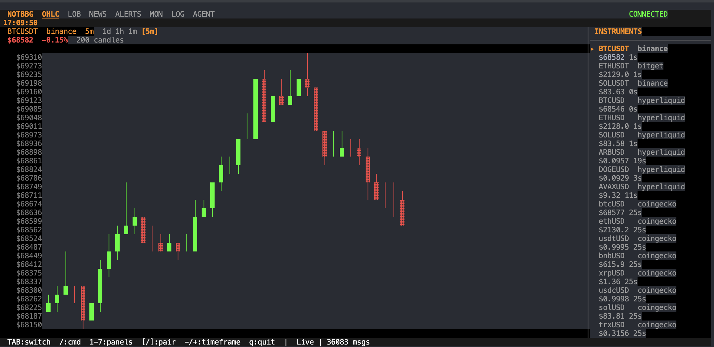

## What's New (2026-04)

A run of recent work added several user-visible features. Screenshot
placeholders below — capture each surface and drop the file at the
indicated path.

- **OHLC progressive backfill** — newest-first: a concurrent 2h
  pass across all (symbol × timeframe) lands first, then a 365d
  deep grind pages newest→oldest. Live (`ohlc.*`) and historical
  (`ohlc-historical.*`) topics are split end-to-end so backfills
  no longer corrupt the SANITY panel's "current mid".
  → `image/README/tui-ohlc-backfill.png`
- **TRADES panel** — per-instrument tape with VWAP / Volume /
  Trades-per-second, virtualized rows, modal picker for
  instrument + venue across all three clients.
  → `image/README/tui-trades.png`,
  `image/README/desktop-trades.png`,
  `image/README/phone/trades.png`
- **SANITY / consistency monitor** — staleness gate (>5min bars
  rejected) + monotonic-timestamp guard prevent year-old
  klines from clobbering the live mid; scrollable with j/k and
  a `↕ N/M` indicator.
  → `image/README/tui-sanity.png`,
  `image/README/desktop-sanity.png`
- **PLOT image cells** — plugin-rendered images surface in the
  TUI's PLOT panel; `o` opens in default viewer, `y` copies the
  filesystem path to the clipboard.
  → `image/README/tui-plot.png`
- **Formulettes plugin (FORM)** — long-lived `bs-cli --repl`
  child for sub-millisecond Black-Scholes recompute, with a
  5s heartbeat republish so the panel never reads "waiting for
  data".
  → `image/README/tui-form.png`,
  `image/README/desktop-form.png`
- **Phone TRADES modal picker** — replaces the old horizontal
  ticker selector with a LOB-style modal showing instrument +
  exchange and a search box. Fixes the "BTCUSDT collapsed across
  three venues" regression.
  → `image/README/phone/trades.png`,
  `image/README/phone/trades-picker.png`
- **Datalake event-time partitioning** — historical bars now
  partition by event time, so a year-old kline written today
  lands in `year=2025/month=05/...` rather than
  `year=2026/...`. DataRange queries return real history.
  → `image/README/datalake-tree.png` *(optional: terminal
  screenshot of `tree datalake/` showing year-spanning partitions)*

## What's Inside

### Clients

Every client talks to the same Go server, so panels stay in sync across devices.

| Client | Stack | Transport | Notes |
|--------|-------|-----------|-------|
| **TUI** | Go + Bubbletea + Lipgloss | Unix socket | 7 panels, embedded Claude agent, full keyboard |
| **Desktop** | Electron + React 19 + Vite | HTTP / SSE | 1:1 port of TUI logic, TradingView charts |
| **Phone** | React Native + Expo | HTTP / SSE | Read-only, sub-second updates via SSE, QR-pair from TUI |

### Data Feeds

17+ adapters across CEX, DEX, indices, FX, commodities, and news.

| Category | Sources | Protocol |
|----------|---------|----------|
| **CEX** | Binance, OKX, Bybit, Bitget | WebSocket |
| **DEX** | Hyperliquid, Uniswap, GMX, dYdX, Drift, Serum, Raydium, Jupiter | WS + DeFi Llama |
| **Indices** | S&P 500, DJIA, NASDAQ, FTSE, DAX, CAC 40, Nikkei, KOSPI, Russell 2000 | Yahoo Finance |
| **FX** | EUR/USD, GBP/USD, USD/JPY, USD/KRW | Yahoo Finance |
| **Commodities** | Gold, Silver, Crude Oil, Natural Gas, US Dollar Index | Yahoo Finance |
| **Crypto** | CoinGecko (50+ tokens), Fear & Greed, Mempool.space | REST |
| **News** | CoinTelegraph, CoinDesk, The Block, Bloomberg, CNBC, FT, Wired, X.com | RSS (20+ feeds) |

### Core Systems

- **Message bus** — in-process pub/sub, one topic per instrument × type
- **Credit-based backpressure** — Erlang GenStage-inspired demand signalling, no drops under load
- **BBolt cache + BM25 search** — on-disk cache of OHLC/news with full-text search
- **Cron scheduler** — periodic REST pulls for non-streaming feeds
- **HTTP/SSE gateway** — token-auth'd snapshot + stream endpoints for desktop/phone
- **Datalake writer** — Hive-partitioned JSONL, local or remote

### Security

- **Transport** — TLS 1.3 + ML-KEM-768 post-quantum key exchange (Cloudflare circl)
- **At rest** — XChaCha20-Poly1305 + Argon2id for config and token encryption
- **Auth** — one-time pairing tokens (10min TTL), session tokens (30-day), separate phone token
- **Phone** — read-only session, no writes, no agent, no config changes

### Remote Collector

Push every tick, candle, and headline to a backup machine over an encrypted relay.

```
Local                                    Remote (home server)
├── server ──TLS 1.3 + ML-KEM-768──►    collector
│                                        └── datalake/type=ohlc/exchange=binance/
│                                               instrument=BTCUSDT/year=2026/...
└── tui / desktop / phone
```

### Embedded AI Agent

- Claude terminal inside the TUI (AGENT panel)
- HTTP agent API in the desktop app
- Skills defined in [SKILLS.md](SKILLS.md) — query feeds, explain candles, search news

## Requirements

Install these before running anything — the Quick Start commands will fail without them.

- **Go 1.25+** — https://go.dev/dl/ or install with your package manager
- **Node 20+** — https://nodejs.org/en/download or install with your package manager
- **make** — https://gnuwin32.sourceforge.net/packages/make.htm (windows only, already installed on macOS/Linux)
- **Expo CLI + EAS** — https://docs.expo.dev/get-started/installation/ (only needed for phone app builds)
- **A remote machine with an open port** — collector backup only (optional)

Verify before continuing: `go version` (need 1.25+) and `node --version` (need v20+)

## Quick Start

One command per surface — pick what you want to look at.

```bash
# Build everything (server + TUI + collector).
make build

# Terminal 1 — server (foreground; Ctrl-C to stop).
make run-server

# Terminal 2 — pick one of:
make run-tui          # bubbletea TUI
make run-desktop      # Electron + React
make run-phone        # Expo dev server (press 'a'/'i' for Android/iOS)

# Health probe (server must be up).
make smoke
```

### OSS / fresh-clone bootstrap

For a lightweight cut that boots cleanly without API keys (binance +
free DEX adapters, 3 majors, 7d backfill, demo plugins only):

```bash
make build
make plugins-oss      # deploy SDK demos + formulettes + monitor + ohlc-png
make run-server-oss   # uses server/configs/dev-oss.yaml
# (or:  make oss-bootstrap   — does both back-to-back)
```

The OSS profile lives at `scripts/plugin-profiles/oss.txt`; the
matching server config lives at `server/configs/dev-oss.yaml`. Switch
back to the full setup any time with `make plugins-full && make
run-server`.

### Phone pairing

The phone reads its session token from the server. With the
server up, run `cat /tmp/notbbg-phone.token` and paste the
output into Settings → TOKEN inside the Expo app. (Or scan the
QR code from `http://localhost:9474/api/v1/pair/qr`.)

On a fresh install the phone redirects to Settings on launch
until a token is stored. After pairing it lands on Watchlist
with a "LIVE — last update Ns ago" indicator showing real-time
freshness.

### Common gotchas

#### "Password for collector localhost:9473:" prompt on TUI launch

The TUI is asking for the **vault password** — the one you used
with `notbbg-collector -init-secrets` (or
`notbbg-server -init-secrets`). It's needed to decrypt a
previously-paired collector token stored in
`~/.config/notbbg/config.yaml`.

The collector is **optional** — it's the remote-backup component
that mirrors the bus to a remote machine's datalake over PQC TLS.
Most users running everything locally don't need it.

Three ways through the prompt:

1. **Type the vault password** (whatever you set with
   `-init-secrets`). The TUI then connects to both the local
   server and pushes a copy to the collector.
2. **Bypass via env var:** `NOTBBG_PASSWORD='<pwd>' make run-tui`.
3. **Drop the collector pairing** (clean slate, no remote
   backup):
   ```bash
   cp ~/.config/notbbg/config.yaml ~/.config/notbbg/config.yaml.bak
   python3 -c "
   import yaml; p='$HOME/.config/notbbg/config.yaml'
   c=yaml.safe_load(open(p)) or {}
   c.setdefault('server',{}).pop('collector_addr',None)
   c.setdefault('server',{}).pop('collector_token',None)
   open(p,'w').write(yaml.dump(c))
   "
   ```
   The TUI now skips the prompt and connects only to the local
   server. Re-pair later with
   `./bin/notbbg pair-collector <host>:9473 <token>`.

#### "Is the collector running?" — checking

```bash
# port test
nc -z localhost 9473 && echo open || echo closed
# process test
pgrep -fl notbbg-collector
```

If you actually want it running:
```bash
# one-time vault init (asks for a password to remember)
./bin/notbbg-collector -init-secrets -enc-config /tmp/collector-secrets.enc

# generate + start (token + password env vars)
TOKEN=$(./bin/notbbg-collector -config server/configs/collector-local.yaml -pair 2>/dev/null \
  | python3 -c "import sys,json; print(json.load(sys.stdin)['token'])")
NOTBBG_TOKEN=$TOKEN NOTBBG_PASSWORD='<vault-pwd>' \
  ./bin/notbbg-collector -config server/configs/collector-local.yaml \
    -enc-config /tmp/collector-secrets.enc &
```

#### TLS handshake fails with `make smoke` on macOS

The macOS system curl ships with LibreSSL/3.3.6 which can't
negotiate against the server's self-signed TLS 1.3 cert. The
target falls back to `/opt/homebrew/opt/curl/bin/curl` (OpenSSL)
and finally a bare `nc -z` port check, so you'll always get a
useful answer. The actual GUIs (Electron Chromium, react-native-sse,
TUI's own Go TLS stack) handle the handshake fine.

## Screenshots

### TUI

| Candlestick (OHLC) | Order Book (LOB) | News Feed |
|---|---|---|
|  | 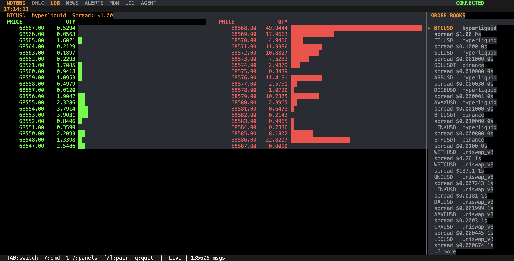 | 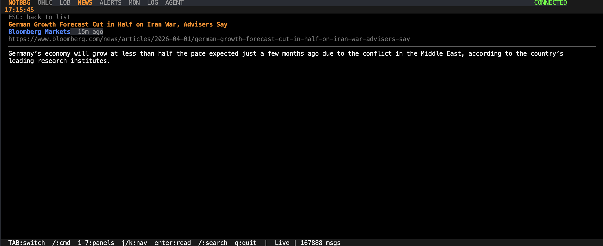 |
| **Article Detail** | **Feed Monitor** | **Phone Pairing** |
| 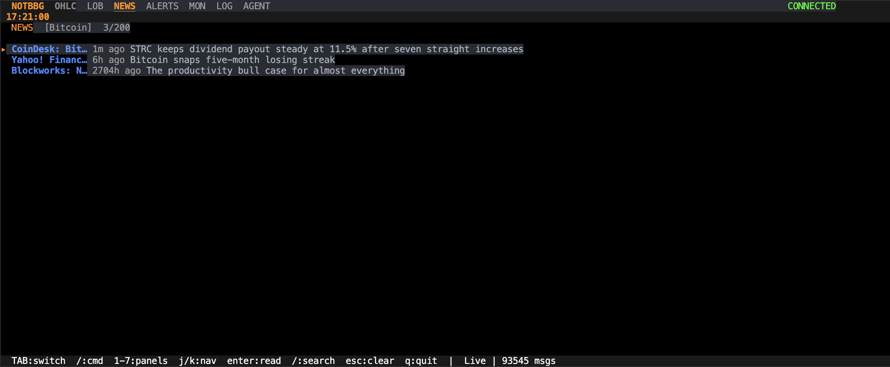 | 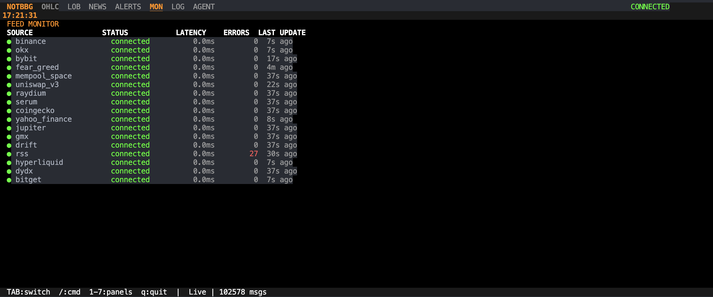 | 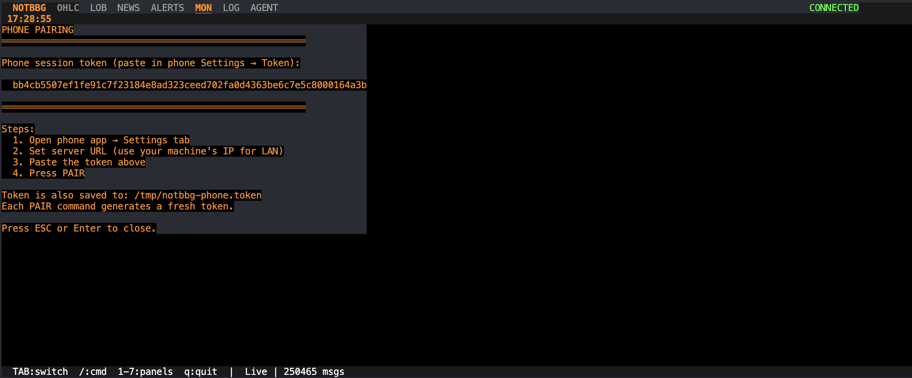 |

**New in 2026-04** *(placeholders — capture and drop in at these paths)*:

| Trades Tape | Sanity / Consistency | OHLC Backfill |
|---|---|---|
|  |  |  |
| **PLOT Image Cells** | **Formulettes (FORM)** | **Scroll Indicator** |
|  |  |  |

### Desktop (Electron)

| OHLC | LOB | News | Pairing |
|---|---|---|---|
| 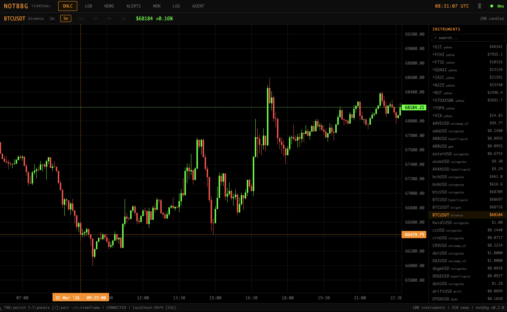 | 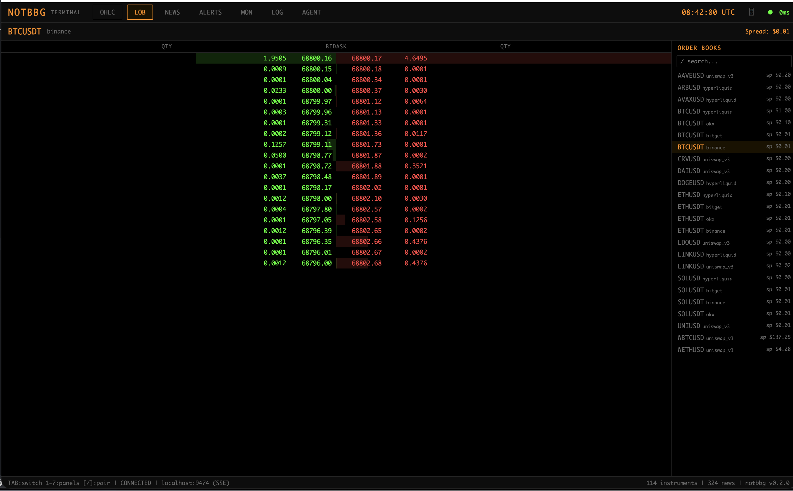 | 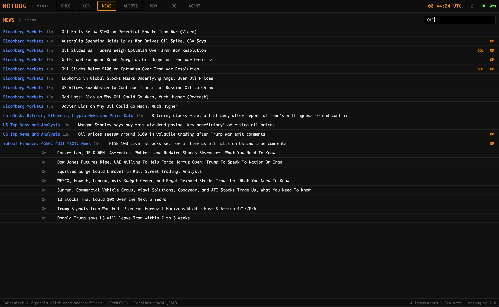 | 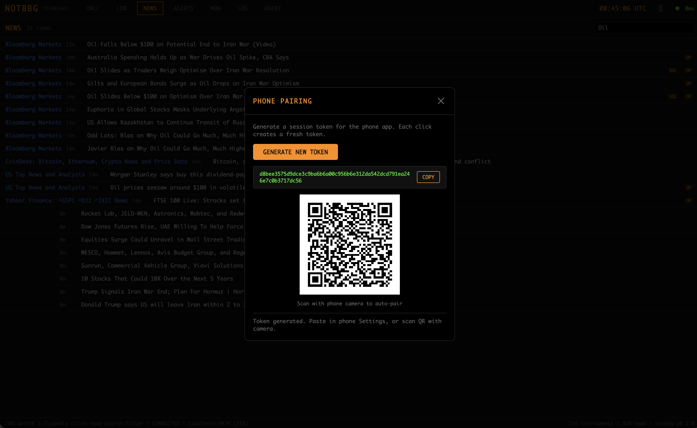 |

**New in 2026-04** *(placeholders)*:

| Trades Tape | Sanity / Consistency | Formulettes (FORM) | OHLC Streaming History |
|---|---|---|---|
|  |  |  |  |

### Phone (React Native, experimental)

| Watchlist | LOB | News (BM25) | Settings |
|---|---|---|---|
| 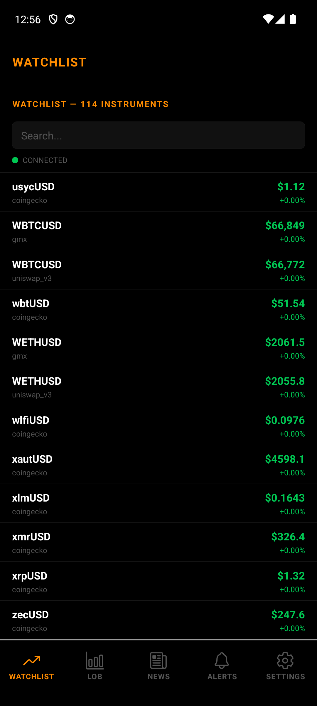 | 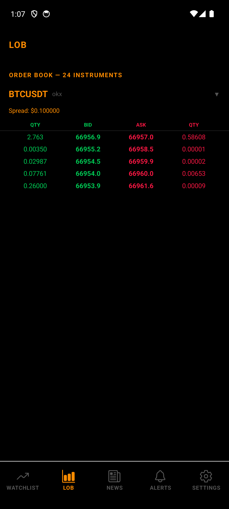 |  | 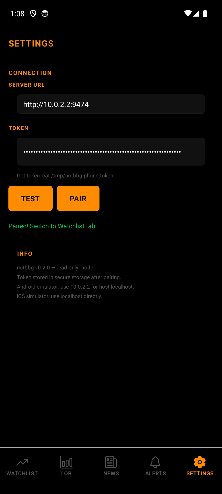 |

**New in 2026-04** *(placeholders)*:

| Trades (modal picker) | Trades — Picker Open | OHLC | Sanity |
|---|---|---|---|
|  |  |  |  |

## Architecture

```
Server (Go)                          Collector (remote)
├── 17 feed adapters (WS/REST)  ──TLS+PQC──►  Datalake writer
├── Message bus (pub/sub)                      (Hive-partitioned JSONL)
├── BBolt cache + BM25 search
├── Credit-based backpressure
├── Cron scheduler
├── HTTP/SSE gateway ──────────►  Desktop (Electron/React)
│   └── /api/v1/snapshot?mode=latest ►  Phone (React Native, polling)
└── Unix socket ───────────────►  TUI (Bubbletea)
```

## Keyboard Shortcuts (TUI)

| Key | Action |
|-----|--------|
| `1`–`7` | Jump to panel (OHLC, LOB, NEWS, ALERTS, MON, LOG, AGENT) |
| `TAB` / `Shift+TAB` | Cycle panels |
| `[` / `]` or `←` / `→` | Previous / next instrument |
| `-` / `+` | Previous / next timeframe |
| `j` / `k` | Navigate news headlines |
| `Enter` | Read article / send agent input |
| `/` | Search instruments or filter news |
| `h` or `?` | Help overlay |
| `q` | Quit |

## CLI Commands

```bash
notbbg                              # Launch TUI
notbbg export ohlc BTCUSDT -f csv   # Export OHLC data
notbbg news search BTC              # Search news by keyword
notbbg feeds list                   # Show feed statuses
notbbg history BTCUSDT              # Query cached data
notbbg agent list                   # List agent skills
notbbg pair-collector host:9473 tok # Pair with remote collector
notbbg pair-collector --forget      # Remove pairing
```

## Build & Test

| Command | What it does |
|---------|-------------|
| `make build` | Server + collector + TUI |
| `make test` | All Go tests (race detector) |
| `make check` | TypeScript checks (phone + desktop) |
| `make dist` | Cross-platform: darwin-arm64, linux-amd64, linux-arm64, windows-amd64 (Windows not fully tested yet) |
| `make phone-dev` | Expo dev server |
| `make phone-apk` | Build APK via EAS |
| `make desktop-dev` | Vite dev server |

## Remote Collector

```bash
# Remote machine:
./bin/notbbg-collector -init-secrets -enc-config configs/secrets.enc
./bin/notbbg-collector -pair                    # print pairing token
NOTBBG_TOKEN=<tok> ./bin/notbbg-collector ...   # start

# Local machine:
./bin/notbbg pair-collector ajax:9473 <token>   # one-time pairing
./bin/notbbg                                    # auto-pushes to collector
```

Data persisted as Hive-partitioned JSONL:

```
datalake/type=ohlc/exchange=binance/instrument=BTCUSDT/year=2026/month=03/day=30/data.jsonl
```

## Roadmap

Planned for future releases (current version is **v0.2.0**):

- **Plugin system** — C/C++ native plugins loaded via shared libs (OMS, backtesting, regime detection, SIMD indicators)
- **More feeds** — OKX/Bitget perpetuals, Gate.io, MEXC, topic-specific RSS (Solana, semiconductors, macro)
- **News polish** — sort by freshness, configurable retention, RSS error monitoring
- **Formal verification** — Gobra proofs for relay invariants, TLA+ model checking
- **Platform** — Windows support (builds today, not fully tested yet), macOS app signing, Android APK distribution

See [SPEC.md](SPEC.md) for the full backlog.

## Project Structure

```
server/           Go server — feeds, bus, cache, auth, transport, datalake, cron
tui/              Go TUI — bubbletea panels, agent terminal, CLI commands
desktop/          Electron + React desktop app
phone/            React Native + Expo phone app (experimental, read-only)
formal/           TLA+ specifications (backpressure protocol)
scripts/          local-test.sh, local-test-desktop.sh
docs/             Data update playbook, per-dataset audits, protocol notes
```

## Dependencies

| Component | Technology | License |
|-----------|-----------|---------|
| Server | Go 1.25 | — |
| TUI | Bubbletea + Lipgloss | MIT |
| Desktop | Electron + React 19 + Vite | MIT |
| Phone | React Native + Expo (experimental) | MIT |
| Charts | lightweight-charts (TradingView) | Apache 2.0 |
| PQC | Cloudflare circl (ML-KEM-768) | BSD-3 |
| Cache | BBolt (etcd) | MIT |
| Crypto | XChaCha20-Poly1305, Argon2id (golang.org/x/crypto) | BSD-3 |
| RSS | gofeed | MIT |
| WebSocket | gorilla/websocket | BSD-2 |

## Documentation

- [PHONE-TESTING.md](PHONE-TESTING.md) — Phone pairing, testing, APK builds
- [TESTING.md](TESTING.md) — Manual testing guide (all components)
- [SECURITY.md](SECURITY.md) — Security model, pairing flow, threat analysis
- [PROTOCOLS.md](PROTOCOLS.md) — Wire protocol, backpressure, PQC handshake
- [SKILLS.md](SKILLS.md) — Agent skills and TUI keyboard reference
- [SPEC.md](SPEC.md) — Roadmap and open TODOs

## License

Apache License 2.0 — see [LICENSE](LICENSE) for the full text.
